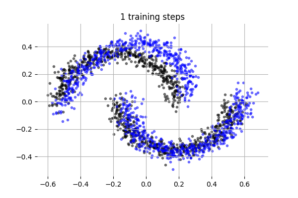
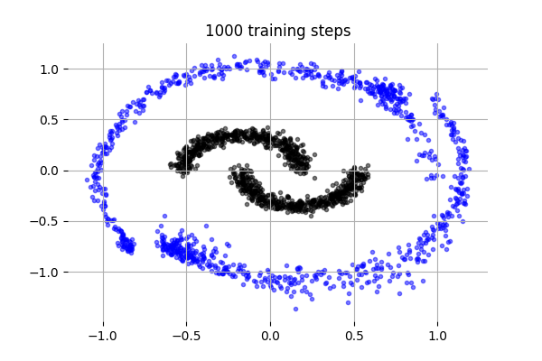
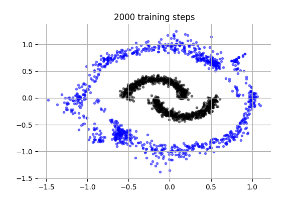
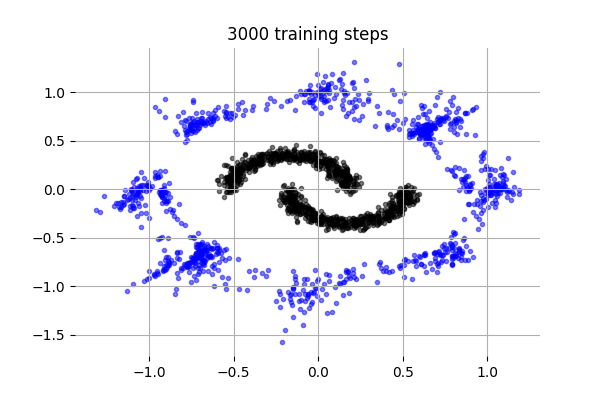
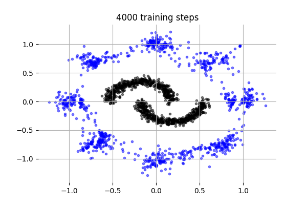
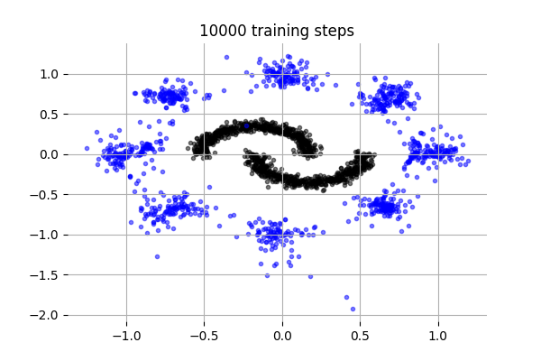

# Rectified flows

[](http://www.repostatus.org/#concept)
[](https://github.com/dirmeier/rectified-flow/actions/workflows/ci.yaml)

> A rectified flow implementation in Flax

## About

This repository implements a rectified flow
which has been proposed in [Flow Straight and Fast: Learning to Generate and Transfer Data with Rectified Flow](https://arxiv.org/abs/2209.03003)
using JAX and Flax.

## Example usage

The `experiments` folder contains a use case where samples from the "Wto Moonss" data set are transported
to the "Eight Gaussian" data set. To train a model and make visualizations, call:

```bash
cd experiments/eight_gaussians_two_moons
python main.py
```

Shown below are samples from the two moons data set (black) that have been transported
to the eight Gaussians data set(blue). Each figure shows the transport
map after x training iterations.

<div align="center">
  
    

    

    
</div>


## Installation

To install the latest GitHub <RELEASE>, just call the following on the
command line:

```bash
pip install git+https://github.com/dirmeier/rflow@<RELEASE>
```

## Author

Simon Dirmeier <a href="mailto:sfyrbnd @ pm me">sfyrbnd @ pm me</a>
